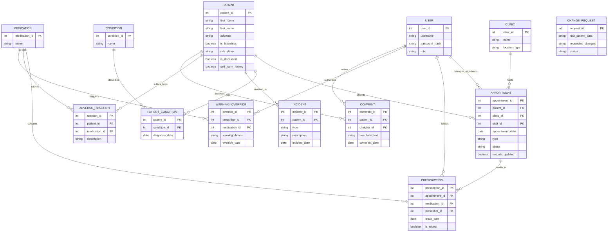

# Mental Health Information System

Java21 / Maven backend for mental health clinic workflows: JDBC data access, role-based REST APIs (Jersey + Grizzly), and JSON via Jackson. The domain covers patients, appointments, prescriptions, incidents, adverse reactions, and change requests for medical records.

## Requirements

- JDK 21  
- Maven 3.9+  
- MySQL 8 (for running the HTTP API against a real database)

## Quick start

```bash
mvn test
```

Tests use an in-memory H2 database (`src/test/resources`) and do not require MySQL.

### Run the REST API

1. Create a MySQL database and apply [`src/main/resources/schema.sql`](src/main/resources/schema.sql).  
2. Insert at least one row into `users` (and seed `clinics` if you create appointments with foreign keys). For local demos, `UserDAO` compares passwords to `password_hash` as plain text.  
3. Set [`src/main/resources/config.properties`](src/main/resources/config.properties) (`db.url`, `db.username`, `db.password`, optional `api.baseUri`).  
4. Start the server by running [`com.skillonnet.automation.Main`](src/main/java/com/skillonnet/automation/Main.java) from your IDE, or after `mvn package` with `java` on the classpath (Jersey + Grizzly + your JAR).

All API routes expect **HTTP Basic Auth**. Role names must be exactly: `Clinical`, `Receptionist`, or `Medical_Records`.

| Role | Example routes |
|------|----------------|
| Clinical | `GET/PUT /patients`, `GET /patients/{id}` |
| Receptionist | `POST /appointments`, `PUT /appointments/{id}/attendance`, `GET /appointments/missed?date=YYYY-MM-DD`, `GET /appointments/pending-records` |
| Medical_Records | `GET /reports/patients-per-clinic`, `GET /reports/prescription-stats`, `POST /reports/change-requests` |

## Data model

Conceptual entity-relationship view (some tables, e.g. `patient_condition` and `comment`, are modeled in code but not all are present in the shipped MySQL DDL—extend `schema.sql` if you need them in the database).



**Field notes (domain semantics)**

- **USER.role:** `Clinical`, `Receptionist`, `Medical_Records`.  
- **CLINIC.location_type:** e.g. Hospital, Health Centre.  
- **APPOINTMENT.type:** e.g. Drop-in, Pre-arranged. **APPOINTMENT.status:** e.g. Attended, Missed, Pending.  
- **INCIDENT.type:** e.g. Deliberate, Accidental.  
- **CHANGE_REQUEST.status:** e.g. Pending, Accepted, Rejected. Change requests store raw payloads only and do not reference `patient_id` in the implemented DAO.

## Project layout

| Area | Package / path |
|------|----------------|
| REST resources | `com.skillonnet.automation.api` |
| JDBC DAOs | `com.skillonnet.automation.dao` |
| Domain models | `com.skillonnet.automation.model` |
| Clinical rules (prescriptions / incidents) | `com.skillonnet.automation.service` |
| MySQL DDL | `src/main/resources/schema.sql` |

## License

This project is provided as-is for coursework or demonstration unless you add a separate license.
