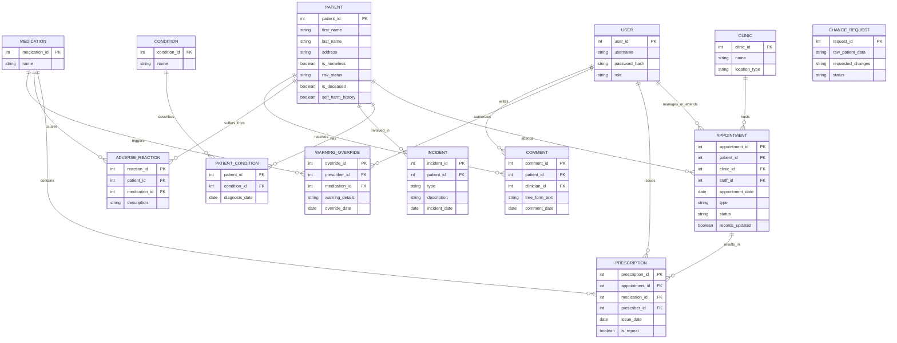

# Mental Health Information System

Java21 / Maven backend for mental health clinic workflows: JDBC data access, role-based REST APIs (Jersey + Grizzly), and JSON via Jackson. The domain covers patients, appointments, prescriptions, incidents, adverse reactions, and change requests for medical records.

## Requirements

- JDK 21  
- Maven 3.9+  
- MySQL 8 (for running the HTTP API against a real database)

## Quick start

```bash
mvn test
```

Tests use an in-memory H2 database (`src/test/resources`) and do not require MySQL. For running the HTTP API against MySQL, copying config, and smoke-testing with `curl`, see [How to test](#how-to-test).

## How to test

### 1. Automated tests (H2, no MySQL)

Runs the full JUnit suite against an in-memory database. No `config.properties` required for this step.

```bash
mvn test
```

- **Pass criteria:** Maven exits with code 0. JUnit XML and logs are under `target/surefire-reports/` (default Surefire output).
- **Scope:** DAOs, services, and models exercised with [`src/test/resources/schema.sql`](src/test/resources/schema.sql) and [`src/test/resources/config.properties`](src/test/resources/config.properties) (H2 in MySQL compatibility mode).

### 2. End-to-end smoke (MySQL + live REST API)

Use this when you want to verify JDBC against a real MySQL instance and the Grizzly/Jersey stack over HTTP.

**Prerequisites:** MySQL listening on the host/port in your JDBC URL (default `localhost:3306`), JDK 21+, Maven on `PATH`.

**a. Configuration (not committed; create locally)**

Copy the template and edit credentials:

```bash
cp src/main/resources/config.properties.example src/main/resources/config.properties
```

Set at least `db.url`, `db.username`, and `db.password`. Optional: `api.baseUri` (default `http://localhost:8080/`). The file [`config.properties.example`](src/main/resources/config.properties.example) lists the keys.

**b. Database and schema**

Create the database, apply DDL, and grant a dedicated user (example uses database `mental_health` and user `mhapp`; adjust names/passwords to match `config.properties`):

```bash
mysql -u root -p -e "CREATE DATABASE IF NOT EXISTS mental_health CHARACTER SET utf8mb4 COLLATE utf8mb4_unicode_ci;"
mysql -u root -p mental_health < src/main/resources/schema.sql
mysql -u root -p -e "CREATE USER IF NOT EXISTS 'mhapp'@'localhost' IDENTIFIED BY 'your_secure_password'; GRANT ALL PRIVILEGES ON mental_health.* TO 'mhapp'@'localhost'; FLUSH PRIVILEGES;"
```

**c. Seed data**

`UserDAO` treats `users.password_hash` as **plain text** for local demos (not production-safe). You need at least one user per role you plan to call, and foreign-key data if you hit nested routes.

Example minimum seed (run in `mysql` against `mental_health` after updating passwords/usernames to match what you will pass in Basic Auth):

```sql
INSERT INTO clinics (name, location_type) VALUES ('Demo Clinic', 'Hospital');
INSERT INTO users (username, password_hash, role) VALUES
  ('clinical1', 'secret', 'Clinical'),
  ('reception1', 'secret', 'Receptionist'),
  ('records1', 'secret', 'Medical_Records');
INSERT INTO patients (first_name, last_name, address, homeless, deceased, self_harm_history)
  VALUES ('Jane', 'Doe', '1 Test St', 0, 0, 0);
INSERT INTO medication (name) VALUES ('Aspirin');
INSERT INTO appointment (patient_id, clinic_id, staff_id, appointment_date, type, status, records_updated)
  VALUES (1, 1, 1, '2026-01-15', 'Drop-in', 'Missed', 0);
INSERT INTO prescription (appointment_id, medication_id, prescriber_id, issue_date, repeat_presc)
  VALUES (1, 1, 1, '2026-01-15', 0);
```

**d. Start the API**

From the project root (classpath includes `mysql-connector-j`):

```bash
mvn -q compile org.codehaus.mojo:exec-maven-plugin:3.1.0:java -Dexec.mainClass=com.skillonnet.automation.Main
```

Leave this process running. Stop with Ctrl+C.

Alternatively, run [`com.skillonnet.automation.Main`](src/main/java/com/skillonnet/automation/Main.java) from your IDE with the same classpath dependencies.

**e. HTTP smoke checks (second terminal)**

All routes use **HTTP Basic Auth**. Role strings must match exactly: `Clinical`, `Receptionist`, or `Medical_Records`.

```bash
# Clinical — list patients
curl -s -w "\nHTTP %{http_code}\n" -u 'clinical1:secret' 'http://localhost:8080/patients'

# Receptionist — missed appointments on a date (must match seeded data)
curl -s -w "\nHTTP %{http_code}\n" -u 'reception1:secret' 'http://localhost:8080/appointments/missed?date=2026-01-15'

# Medical_Records — reporting
curl -s -w "\nHTTP %{http_code}\n" -u 'records1:secret' 'http://localhost:8080/reports/patients-per-clinic'
curl -s -w "\nHTTP %{http_code}\n" -u 'records1:secret' 'http://localhost:8080/reports/prescription-stats'
```

Expect HTTP **200** and JSON bodies when auth and data are valid. Without credentials you should see **401**.

| Role | Example routes |
|------|----------------|
| Clinical | `GET` / `PUT /patients`, `GET /patients/{id}` |
| Receptionist | `POST /appointments`, `PUT /appointments/{id}/attendance`, `GET /appointments/missed?date=YYYY-MM-DD`, `GET /appointments/pending-records` |
| Medical_Records | `GET /reports/patients-per-clinic`, `GET /reports/prescription-stats`, `POST /reports/change-requests` |

## Data model

Conceptual entity-relationship view (some tables, e.g. `patient_condition` and `comment`, are modeled in code but not all are present in the shipped MySQL DDL—extend `schema.sql` if you need them in the database).



**Field notes (domain semantics)**

- **USER.role:** `Clinical`, `Receptionist`, `Medical_Records`.  
- **CLINIC.location_type:** e.g. Hospital, Health Centre.  
- **APPOINTMENT.type:** e.g. Drop-in, Pre-arranged. **APPOINTMENT.status:** e.g. Attended, Missed, Pending.  
- **INCIDENT.type:** e.g. Deliberate, Accidental.  
- **CHANGE_REQUEST.status:** e.g. Pending, Accepted, Rejected. Change requests store raw payloads only and do not reference `patient_id` in the implemented DAO.

## Project layout

| Area | Package / path |
|------|----------------|
| REST resources | `com.skillonnet.automation.api` |
| JDBC DAOs | `com.skillonnet.automation.dao` |
| Domain models | `com.skillonnet.automation.model` |
| Clinical rules (prescriptions / incidents) | `com.skillonnet.automation.service` |
| MySQL DDL | `src/main/resources/schema.sql` |

## License

This project is provided as-is for coursework or demonstration unless you add a separate license.
